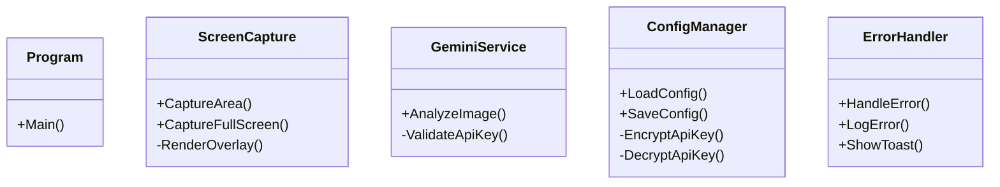
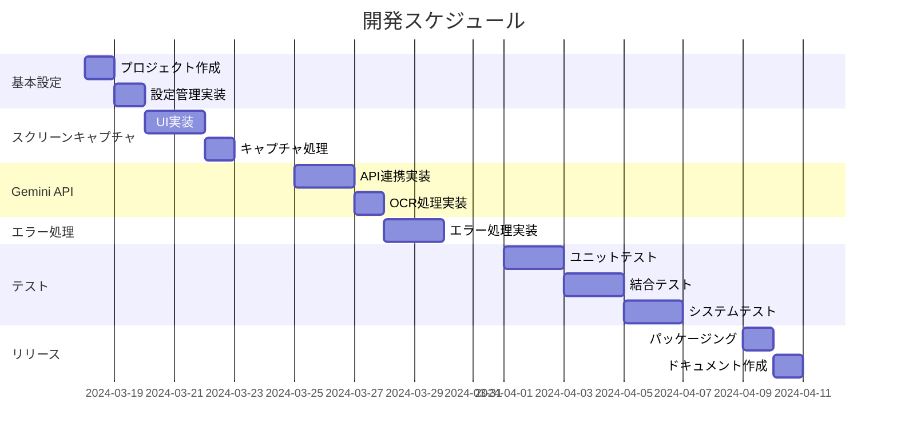

# Gemini OCR Capture 実装手順書

## 1. 開発環境セットアップ

### 1.1 必要なツール
* Visual Studio 2022 Community Edition以上
* .NET 8.0 SDK
* Git（バージョン管理用）

### 1.2 推奨VS拡張機能
* GitHub Copilot（コーディング支援）
* CodeMaid（コード整形）
* ReSharper（コード品質改善）

### 1.3 開発環境構築手順
1. Visual Studioのインストール
   - Windowsデスクトップ開発ワークロードを選択
   - .NET 8.0 SDKを含める
2. Gitのインストールと初期設定
3. プロジェクトの作成
   - WinFormsアプリケーション（.NET 8.0）

## 2. プロジェクト構成

### 2.1 ソリューション構造
```
GeminiOcrCapture/
├── src/
│   ├── GeminiOcrCapture/          # メインアプリケーション
│   ├── GeminiOcrCapture.Core/     # ビジネスロジック
│   └── GeminiOcrCapture.Tests/    # ユニットテスト
└── docs/
    ├── requirement.md             # 要件定義書
    └── implementation_guide.md    # 本手順書
```

### 2.2 主要クラス設計


## 3. 実装手順

### 3.1 基本設定（1日目）
1. プロジェクト作成
   - ソリューション構造の作成
   - 必要なNuGetパッケージの追加
2. 設定ファイル管理の実装
   - ConfigManagerクラスの実装
   - 暗号化機能の実装

### 3.2 スクリーンキャプチャ機能（2-3日目）
1. キャプチャUI実装
   - オーバーレイウィンドウの作成
   - マウスドラッグ処理の実装
2. キャプチャ処理実装
   - 範囲指定キャプチャ
   - フルスクリーンキャプチャ

### 3.3 Gemini API連携（3-4日目）
1. APIクライアント実装
   - GeminiServiceクラスの実装
   - エラーハンドリング実装
2. OCR処理実装
   - 画像前処理
   - API呼び出し処理

### 3.4 エラー処理（4-5日目）
1. エラーハンドリング実装
   - エラーログ機能
   - トースト通知実装
2. 例外処理の実装
   - カスタム例外クラス
   - グローバルエラーハンドラー

## 4. テスト計画

### 4.1 ユニットテスト（5-6日目）
* ConfigManagerのテスト
* GeminiServiceのテスト
* ScreenCaptureのテスト
* ErrorHandlerのテスト

### 4.2 結合テスト（6-7日目）
* 画面キャプチャ→OCR→クリップボード連携
* エラーハンドリング→通知→ログ出力
* 設定保存→読み込み

### 4.3 システムテスト（7-8日目）
* エンドツーエンドテスト
* パフォーマンステスト
* セキュリティテスト

## 5. リリース準備（8-9日目）

### 5.1 パッケージング
1. シングルファイル実行ファイル作成
2. インストーラー作成（オプション）

### 5.2 ドキュメント作成
1. ユーザーマニュアル
2. APIドキュメント
3. トラブルシューティングガイド

## 6. 開発スケジュール



## 7. コーディング規約

### 7.1 命名規則
* クラス名: PascalCase
* メソッド名: PascalCase
* 変数名: camelCase
* 定数: UPPER_CASE
* プライベートフィールド: _camelCase

### 7.2 コードスタイル
* インデント: スペース4文字
* 中括弧: 新しい行に配置
* using文: ファイル先頭にまとめる
* 最大行長: 120文字

### 7.3 コメント規則
* パブリックAPI: XMLドキュメントコメント
* 複雑なロジック: 説明コメント
* TODO/HACK: 理由と対応予定を明記

## 8. 品質基準

### 8.1 コード品質
* カバレッジ: 80%以上
* Cyclometric Complexity: 15未満
* メソッド行数: 50行以下
* クラス行数: 500行以下

### 8.2 パフォーマンス
* キャプチャ～OCR完了: 5秒以内
* メモリ使用量: 200MB以下
* 起動時間: 1秒以内

## 9. セキュリティ対策

### 9.1 API認証情報
* APIキーの暗号化保存
* メモリ上での最小限の保持

### 9.2 エラー情報
* 機密情報のログ出力制限
* スタックトレースの制御

## 10. 保守運用

### 10.1 トラブルシューティング
* エラーログの定期確認
* パフォーマンスモニタリング

### 10.2 アップデート対応
* Gemini API更新対応
* Windows更新対応